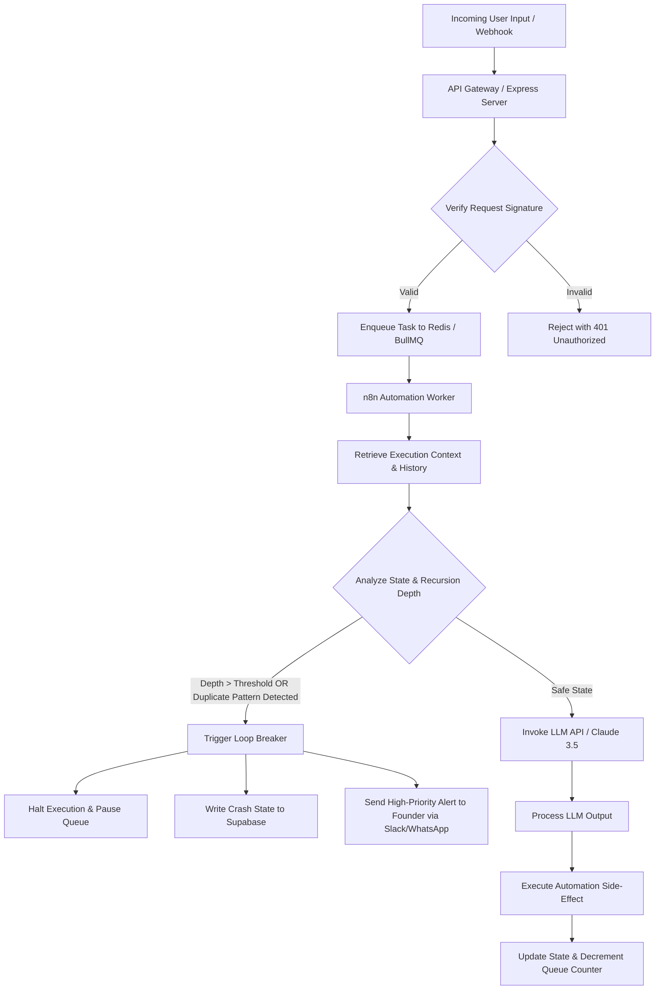

# 🛡️ PresenceIX Orchestrator

### *Enterprise-Grade safety controllers and reliability engineering architectures for Agentic AI Automation.*

---

## 🚀 The Context & The "Why"
In production-grade AI agentic workflows—particularly those orchestrating advanced Large Language Models (LLMs) like **Claude 3.5 Sonnet** through complex visual flow platforms like **n8n**—reliability is paramount. 

A common, critical failure mode in autonomous workflows is the **infinite recursion loop**. This occurs when an agent misinterprets its tool output, struggles with validation, or encounters an unexpected API signature, and repeatedly triggers the exact same sub-action. In standard systems, this causes two critical issues:
1. **Runaway Financial Costs:** Cascading high-volume API requests can rack up thousands of dollars in billing in minutes.
2. **Service Denial:** Infinite loops saturate background workers and rate-limit API tokens, taking down entire operational channels.

**PresenceIX Orchestrator** implements a stateless, low-latency **Loop-Breaker Safety System** using **Redis**, **BullMQ**, and **Supabase** to detect, halt, and audit runaway AI agents before they scale out of control.

---

## 📊 Loop-Breaker Architectural Blueprint

The Orchestrator maintains tight circuit-breaker policies on all active automation execution paths. Below is the system flow:



---

## 🛠️ System Design & Core Safeguards

### ⚡ 1. Low-Latency State Tracking (Redis)
To minimize overhead on active workflows, loop-checking must be extremely fast. We maintain sliding-window token execution states inside Redis:
* **Temporary Cache:** Active tracks use specific hashes with an expiration time (`EXPIRE` set to 300 seconds).
* **Multi-Transaction Pipelines (`MULTI`/`EXEC`):** Ensures that depth incrementing, TTL resets, and last-state hash lookups happen atomically in a single, non-blocking roundtrip.

### 🧠 2. Dual-Rule Recursion Detection
* **Execution Depth Guard:** Halts the workflow immediately if the depth counter for a specific user action exceeds the maximum threshold (default: `5`).
* **State Hash Matching:** Compares the SHA-256 payload hash of the current run with the preceding execution. If they are identical (suggesting a state-stuck loop), the circuit is broken.

### 🛡️ 3. Automated Fail-Safe Protocols
* **BullMQ Queue Pausing:** Halts queue processing immediately to stop the loop at the server layer.
* **Supabase Telemetry Ledger:** Stores the full `CRASH_STATE` payload (including LLM prompts, tool outputs, and historical context) for comprehensive post-mortem auditing.
* **Emergency Paging Webhook:** Sends an active message with markdown summary context to Discord/Slack/WhatsApp alert lines for immediate developer intervention.

---

## 📂 Repository Structure
```
presenceix/
├── src/
│   └── loopBreaker.ts  # Core TypeScript Loop-Breaker Controller
├── tsconfig.json       # TypeScript compiler configurations
├── package.json        # Node.js dependencies & scripts
├── .gitignore          # Version control file filters
└── README.md           # Technical documentation and system layout
```

---

## 🚀 Getting Started

### 📋 Prerequisites
- Node.js 18.x or higher
- Redis Server (local or cloud instance)

### 🔧 Setup & Installation

1. **Clone the repository:**
   ```bash
   git clone https://github.com/kachiezibe/presenceix.git
   cd presenceix
   ```

2. **Install node dependencies:**
   ```bash
   npm install
   ```

3. **Configure Environment Variables (`.env`):**
   ```env
   REDIS_URL=redis://localhost:6379
   SUPABASE_URL=https://your-project.supabase.co
   SUPABASE_SERVICE_ROLE_KEY=your-supabase-service-key
   EMERGENCY_ALERTS_WEBHOOK=https://hooks.slack.com/services/your/alert/hook
   ```

4. **Compile TypeScript:**
   ```bash
   npm run build
   ```

---

## 📝 Implementation Code

The core controller (`src/loopBreaker.ts`) is designed as a reusable system middleware. It implements state analysis and automatic fail-safes:

```typescript
import Redis from 'ioredis';
import { Queue } from 'bullmq';
import { createClient } from '@supabase/supabase-js';

// ... (See src/loopBreaker.ts for full implementation)
```

---

## 🛡️ License
Distributed under the MIT License. See `LICENSE` for more information.

---

## 💡 About PresenceIX
Founded by Kachi Ezibe, **PresenceIX** is a custom systems automation and AI integration agency that builds robust, high-performance backends for businesses looking to safely scale operational efficiency.
